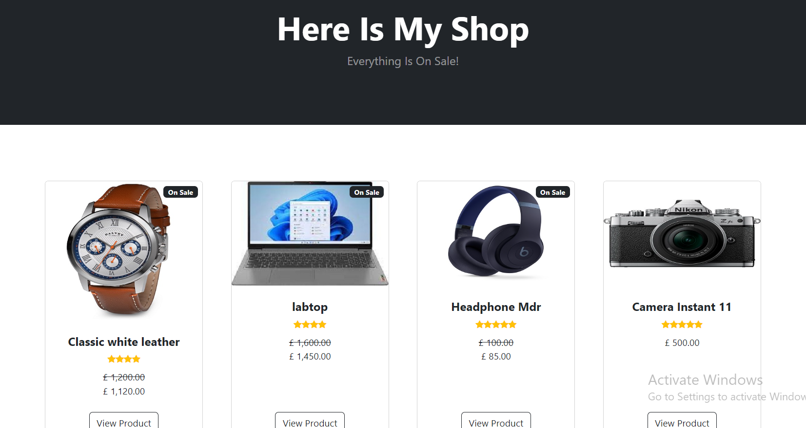
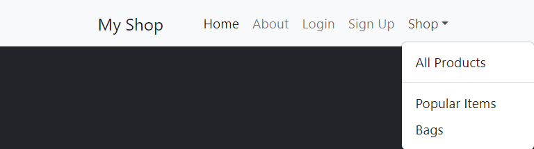
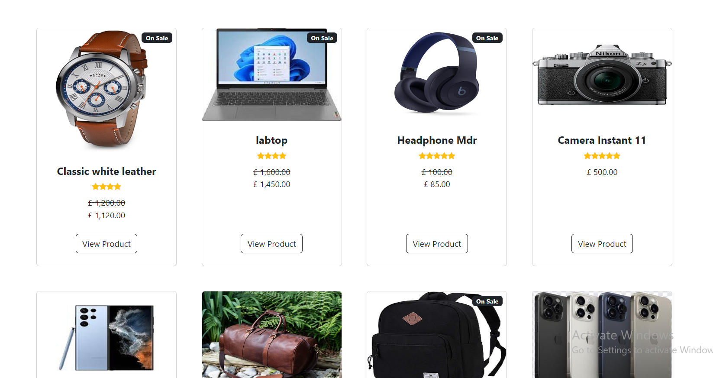
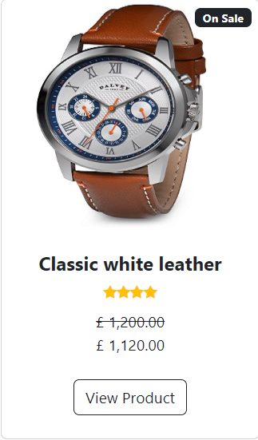
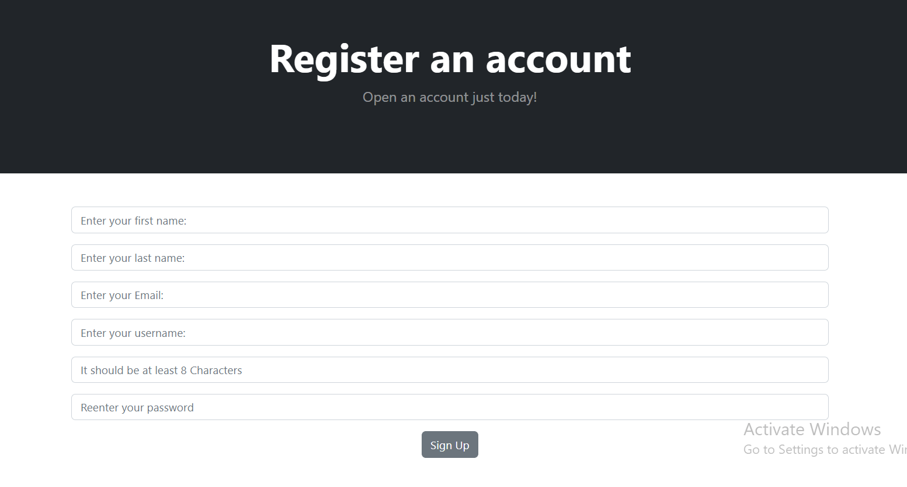
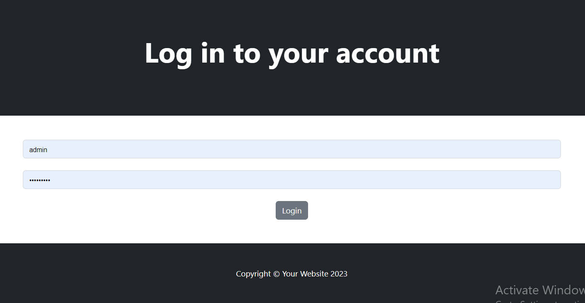

# E-Commerce Website

"Our e-commerce website simplifies the online shopping experience by providing users with a curated selection of product categories and a seamless sign-up/register process. With a focus on user convenience, our platform offers easy navigation through various product categories, allowing users to explore and discover items of interest effortlessly.

# Project goals:

- To create a website were users can create, read, upadte and delete data
- To experiment with the relationship between python and other languages

# Target Audience goals:

- To be able to navigate around the site
- To be able to create, read, update and delete data

# Current Features:

## Navbar

- Includes links to all the different pages accross the site.
- The navbar is accessible in any page of sites
- Is responsive on smaller screens turning into a side nav on small devices.
- When a user is logged in, the signup and login options are replaced with a sign-out option.

# Home page

- The homepage of my website includes a selection of products and a navigation bar for easy browsing.

- Users can access all products, popular items, or specific categories such as bags.

# Products

- There are eight products featured on our homepage. Users can view all of them by scrolling down.
  
- There are some features including Name, Description, Price, Category, Picture, Star, and On-sale tags.
  

# User Forms

## Create account form

-Allows a new user to create an account on the database

## Login form

- Allows a returning user to log back into their account
  

there are three Django models: Category, Customer, and Product. Let's analyze the relationships between them:

Category Model:

This model represents a category for products.
There is no explicit relationship defined in this model.
Customer Model:

This model represents a customer.
There is no explicit relationship defined in this model.
Product Model:

This model represents a product.
It has a ForeignKey relationship with the Category model, indicating that each product belongs to a single category. This is a many-to-one (or one-to-many) relationship where one category can have multiple products but each product belongs to only one category.
