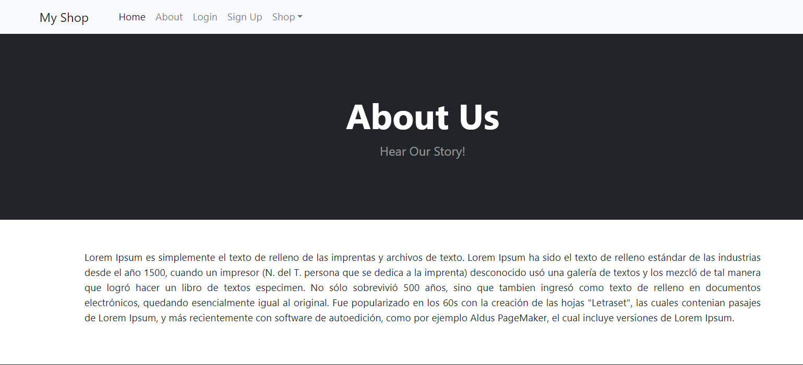

# E-Commerce Website

"Our e-commerce website simplifies the online shopping experience by providing users with a curated selection of product categories and a seamless sign-up/register process. With a focus on user convenience, our platform offers easy navigation through various product categories, allowing users to explore and discover items of interest effortlessly.

# Project goals:

- To create a website were users can create, read, upadte and delete data
- To experiment with the relationship between python and other languages

# Target Audience goals:

- To be able to navigate around the site
- To be able to create, read, update and delete data

# Current Features:

## Navbar

- Includes links to all the different pages accross the site.
- The navbar is accessible in any page of sites
- Is responsive on smaller screens turning into a side nav on small devices.
- When a user is logged in, the signup and login options are replaced with a sign-out option.

- Users can access all products, popular items, or specific categories such as bags.

# Home page

- The homepage of my website includes a selection of products and a navigation bar for easy browsing.

# Products

- There are ten products featured on our homepage. Users can view all of them by scrolling down.

  

# Product

- There are some features including Name, Description, Price, Category, Picture, Star, and On-sale tags.
- If a user clicks on the 'View Product' button, it directs them to a new page providing detailed information about the product.

  

# View Product page

- When a user clicks on the 'View Product' button, a new page will open displaying the product's name, detailed description, price, and a 'Back to Home Page' button.

# Popular Items

- There is a seprate pages which shows Popular Items

# Bags

- There is a seprate page for Products

# About

- There is an 'About' page that describes the story of our company.

# User Forms

## Create account form

-Allows a new user to create an account on the database

## Login form

- Allows a returning user to log back into their account

  

# Future Features

Given the time constraints during the development of this site, there are several features that I plan to implement in the near future. These include:

- Basket Feature: I aim to introduce a basket feature that allows users to select products and store them in their accounts. This feature will enhance the shopping experience by enabling users to collect items before making a purchase.

- Payment Page: Additionally, I plan to integrate a payment page to facilitate seamless transactions. This will enable users to complete purchases directly on the site, improving convenience and efficiency.

By implementing these features, I aim to enhance the functionality and user experience of the site, ultimately providing a more comprehensive and convenient platform for users to shop and make transactions.

# Database

I used ElephantSQL to as my database.

there are three Django models: Customer, Category, and Product. Let's analyze the relationships between them:

- Customer Model:

This model represents a customer.
There is no explicit relationship defined in this model.

- Category Model:

This model represents a category for products.
There is no explicit relationship defined in this model.

- Product Model:

This model represents a product.
It has a ForeignKey relationship with the Category model, indicating that each product belongs to a single category. This is a many-to-one (or one-to-many) relationship where one category can have multiple products but each product belongs to only one category.

## Django Administration

As it displays the user accounts, products, and categories, they are being saved in our database.

# Technologies Used

- HTML5 To create the structure and the content of the website

- CSS3 To create the style for the website and its content

- Javascript creates the functionality for the website

- Python creates the backend for the website

- Django

# Bugs

- Heroku doesn't connect to database correctly resulting in errors when on the deployed site, the error doesn't occur if I host the site locally in github.
